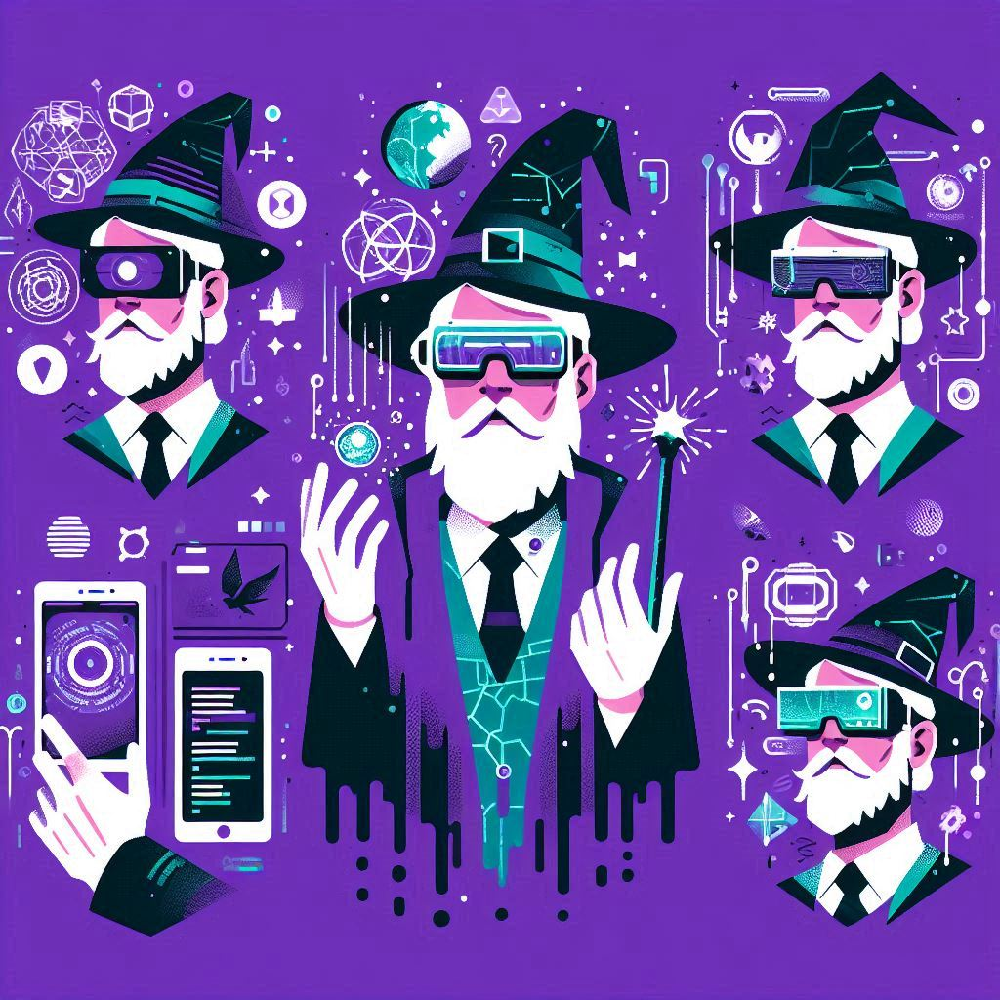
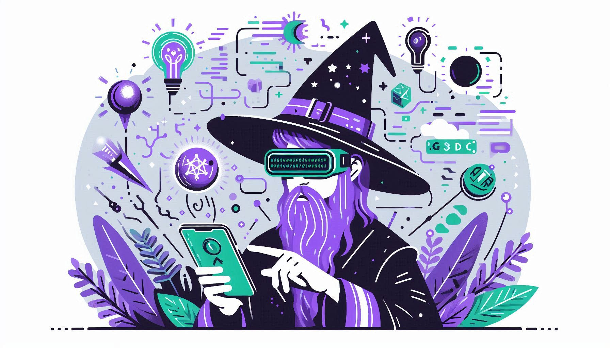
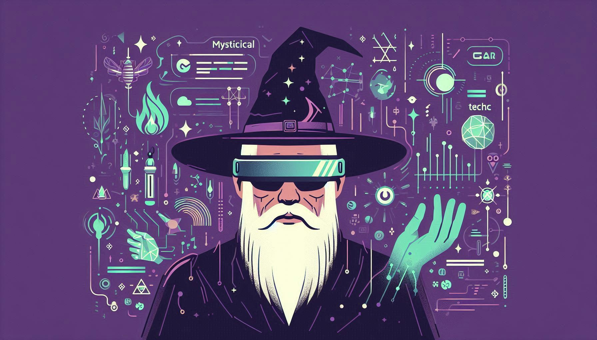
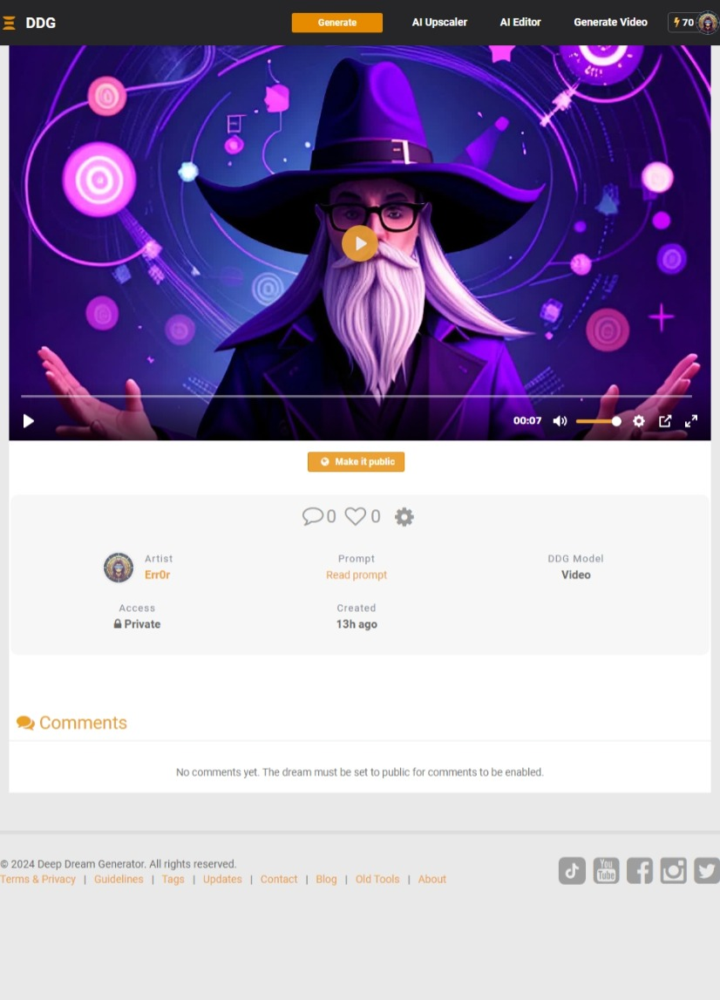
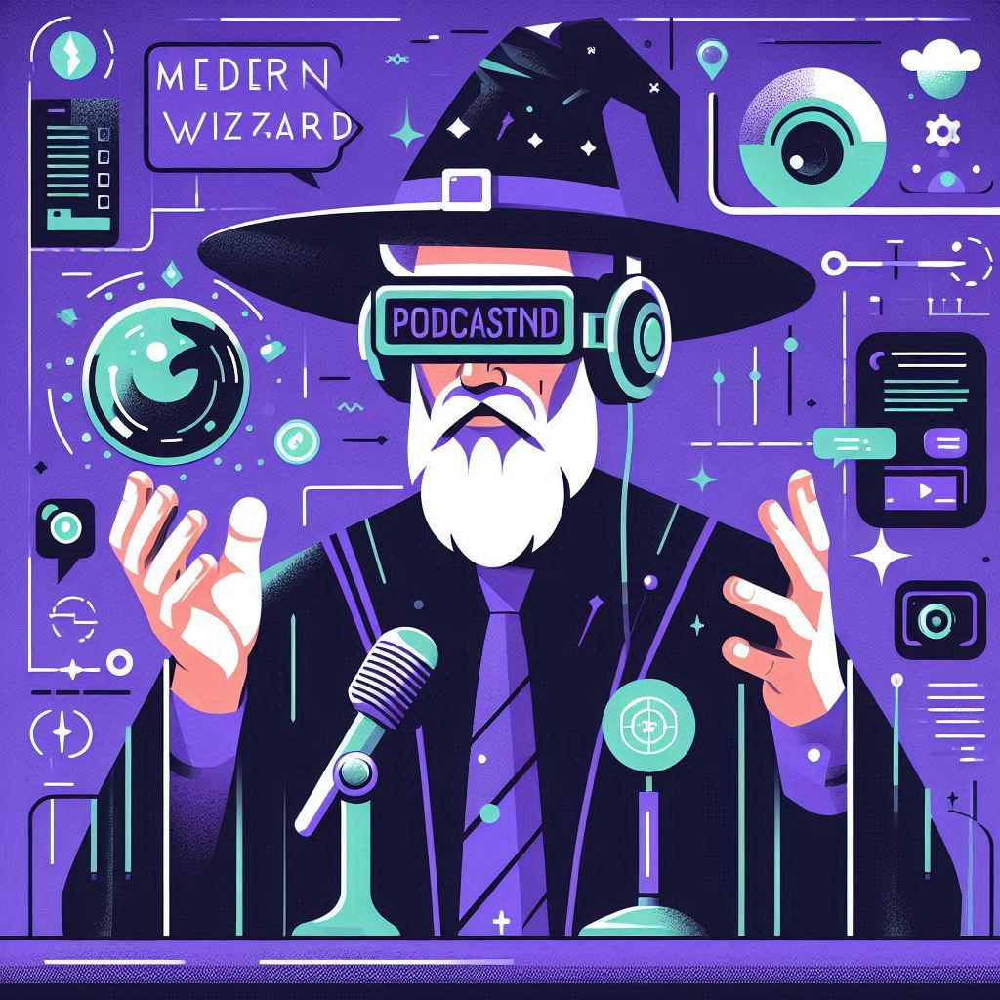

# Criando um Podcast com IAs Generativas

## 🛠️ Ferramentas

- **ChatGPT** para IA generativa de textos.
- **Microsoft Designer** para IA generativa de identidade visual (imagens).
- **Deep Dream Generator** para IA generativa de animação de 8 segundos.
- **ElevenLabs** para IA generativa de *Text To Speech*.
- **Microsoft Clipchamp** para edição de vídeo.

## 🚀 Metodologia

### 📜 ChatGPT: Geração do Nome do Podcast

```txt
Como roteirista de um podcast sobre dicas e novidades de tecnologia front-end, sugira 7 nomes para um podcast de front end.

{REGRAS}

- Crie o nome com trocadilhos;
- Utilize mistura de idiomas (inglês, português, latin, espanhol, etc.);
- O nome deve conter alguma palavra forte relacionado a código fonte;
- Crie um subtítulo enxuto;

{REGRAS NEGATIVAS}

- Não utilizar as palavras: JavaScript, Developer, Desenvolvedor, ou outras palavras de bibliotecas/frameworks;
```

Resultado:

```txt
Aqui estão sete sugestões para o nome do seu podcast de front-end, com os trocadilhos e misturas de idiomas que você pediu:

Code Crú
Dicas de front-end sem filtro

Pó de Bits
Magia e técnica no mundo do código

Tag-tics
A alquimia do HTML ao CSS

Byte por Byte
A arte de tecer interfaces

El Syntaxo
Onde código e design se encontram

Código Misturê
Entre linhas e estilos

Vim Ver Code
A jornada do front em cada tecla
```

### 📐 ChatGPT: Definição da Identidade Visual

```txt
Como designer de um podcast sobre dicas e novidades de tecnologia front-end, sugira identidades visuais para o podcast Pó de Bits: Magia e técnica no mundo do código.
```

Resultado:

```txt
Para o podcast "Pó de Bits: Magia e técnica no mundo do código," a identidade visual pode combinar elementos de magia com tecnologia, criando uma atmosfera encantadora e técnica ao mesmo tempo. Aqui estão algumas ideias:

Paleta de Cores:

Tons místicos: Roxos e violetas para dar um toque mágico.
Verdes neon ou ciano: Para remeter à tecnologia e ao brilho de telas.
Prateados ou metálicos: Como acentos que simbolizam circuitos ou componentes tecnológicos.

Tipografia:

Fonte principal: Uma fonte serifada que lembre grimórios antigos, trazendo a ideia de feitiçaria.
Fonte secundária: Uma fonte sans-serif moderna e clean, criando contraste com o lado técnico.

Ícones e Símbolos:

Varinha mágica lançando bits no ar, como se fossem faíscas tecnológicas.
Linhas de código flutuando no fundo, misturadas com poeira estelar ou partículas brilhantes.
Circuitos estilizados, entrelaçados com runas mágicas ou símbolos místicos.

Elementos Gráficos:

Tela de computador com uma névoa mágica saindo dela, representando o encontro da magia com a tecnologia.
Cubo de cristal com bits flutuando dentro, representando o "pó de bits".
Ilustrações de feitiços com componentes tecnológicos como chips e placas de circuito.

Mascote ou Figura:

Um mago moderno que usa óculos de realidade aumentada e conjura códigos ao invés de feitiços, com uma estética futurista misturada com trajes clássicos de mago.

Estilo de Ilustração:

Ilustrações em estilo flat design, com traços minimalistas e um toque de sombreado para destacar os elementos mágicos e tecnológicos.
Texturas digitais, como pixels ou glitch art, que aparecem em momentos chave da identidade.
Essa identidade visual pode ser usada no logo, capas de episódios, redes sociais e outros materiais promocionais, criando uma marca que reflete tanto o lado técnico quanto a magia da programação.
```

### ✍️ ChatGPT: Roteiro

```txt
Como roteirista do podcast Pó de Bits, crie um roteiro descontraído e informativo no seguinte formato:

[INTRODUÇÃO]
[CURIOSIDADE 1]
[PERGUNTAS E RESPOSTAS]
[CURIOSIDADE 2]
[FINALIZAÇÃO]

{REGRAS}
- Em [INTRODUÇÃO], faça uma apresentação parodiando uma biografia;
- Em [CURIOSIDADE 1] aborde curiosidades do antigo Shockwave Player;
- Em [PERGUNTAS E RESPOSTAS] aborde usos inusitados do HTML e CSS;
- Em [CURIOSIDADE 2] aborde sobre ferramentas para front ends;
- Em [FINALIZAÇÃO] faça uma despedida poética do episódio Pó de Bits
- O podcast vai ser apresentado apenas pelo mago Teryn;
- O podcast deve ser curto;


{REGRAS NEGATIVAS}
- Evitar muitos termos técnicos;
- Não ultrapassar 10 minutos;
```

Resultado:

```txt
[INTRODUÇÃO]

(Som de partículas mágicas se dispersando)

Teryn: "Saudações, seres encantados e codificadores ocultos. Eu sou Teryn, o mago digital que conjura linhas de código e, às vezes, transforma bugs em pequenos feitiços de sabedoria. Nasci em uma linha de código perdida no tempo, cresci entre tabs e espaços, e hoje sou mestre das artes ocultas do front-end. Sejam bem-vindos ao 'Pó de Bits,' onde a magia e a técnica se encontram!"

(Som de faíscas tecnológicas)

[CURIOSIDADE 1 - Shockwave Player]

Teryn: "Antes de navegarmos pelo HTML e CSS, vamos falar de uma relíquia dos tempos arcanos: o Shockwave Player. Ah, sim, jovens aprendizes, houve uma época em que esse feitiço era essencial para dar vida às animações e aos jogos no navegador. Lançado nos longínquos anos 90, ele era como uma varinha mágica para os desenvolvedores. Mas assim como toda mágica tem seu limite, o Shockwave foi superado por novos feitiços, como o Flash, e hoje, resta apenas na memória daqueles que testemunharam sua era dourada."

[PERGUNTAS E RESPOSTAS - Usos inusitados de HTML e CSS]

Teryn: "Agora, vamos para a sessão que vocês adoram: perguntas e respostas! E hoje temos uma pergunta que veio de um ouvinte que se considera um alquimista do CSS: ‘É possível usar HTML e CSS de formas inusitadas?’ Ah, meus caros, o front-end está cheio de encantos inesperados!"

(voz mais divertida)

Teryn: "Por exemplo, vocês sabiam que, com HTML e CSS, é possível criar um jogo de xadrez completo? Só com essas linguagens! É como usar magia para transformar uma simples pedra em ouro! E tem mais: já vi front-ends criativos criarem relógios digitais, animações complexas, e até memes animados, tudo sem tocar em JavaScript!"

(pausa dramática)

Teryn: "Inusitado, né? Mas lembrem-se, magia é sobre controle e disciplina, não saiam por aí tentando transformar o CSS em uma poção de tempo, a menos que queiram brincar com forças que nem sempre podemos controlar!"

[CURIOSIDADE 2 - Ferramentas para Front-Ends]

Teryn: "Agora, falemos de poderosas ferramentas que cada front-end deveria ter em sua bolsa mágica. Uma delas é o Figma! Sim, é como ter uma varinha que permite desenhar interfaces mágicas com facilidade. Para conjurar design e código juntos, temos o Visual Studio Code — a espada afiada que corta qualquer bug ao meio."

(som de magia sendo conjurada)

Teryn: "E se você é daqueles que gosta de otimizar seus feitiços, o Prettier pode ajudar a manter seu código impecável, como um pergaminho bem escrito. Mas, meus queridos, cuidado para não se perder em tantas ferramentas... O verdadeiro mago sabe que a simplicidade também é uma forma de arte."

[FINALIZAÇÃO]

Teryn: "E assim, queridos aprendizes e mestres do código, chegamos ao fim de mais uma jornada pelo 'Pó de Bits.' Que suas linhas sejam leves como a brisa, e seus bugs, passageiros como um feitiço de curto alcance. Lembrem-se: o verdadeiro poder está nas pequenas partículas que formam o todo, nos bits que voam por entre as dimensões do front-end. Até o próximo encontro, onde a magia e a técnica se cruzam mais uma vez... Em cada linha, em cada pixel, há um pouco de magia esperando para ser conjurada."

(Som de ventos místicos ao fundo, finalizando com um toque de magia sutil)

Esse roteiro mantém o clima descontraído e curto, ideal para um episódio de menos de 10 minutos.
```

### 🎨 Microsoft Designer: Visual

```txt
Um mago moderno que usa óculos de realidade aumentada e conjura códigos ao invés de feitiços. Ilustrações em estilo flat design, com traços minimalistas e um toque de sombreado para destacar os elementos mágicos e tecnológicos. Tons roxos místicos, verdes cibernéticos e metálicos techs.
```



Design criado


```txt
Um senhor mago moderno entrevistador que usa óculos de realidade aumentada e conjura códigos ao invés de feitiços. Ilustrações em estilo flat design, com traços minimalistas e um toque de sombreado para destacar os elementos mágicos e tecnológicos. Tons roxos místicos, verdes cibernéticos e metálicos techs.
```



```txt
Um mago, de barba média branca, moderno entrevistador que usa óculos de realidade aumentada e conjura códigos ao invés de feitiços. Ilustrações em estilo flat design, com traços minimalistas e um toque de sombreado para destacar os elementos mágicos e tecnológicos. Tons roxos místicos, verdes cibernéticos e metálicos techs
```



### 🌀 Deep Dream Generator: Animação

Imagens utilizadas como prompts de entrada:



Animação gerada:

[](./out/Teryn.mp4)

### 🎙️ Eleven Labs

A voz de Teryn (Text-to-Speech), o mago, e alguns efeitos, estão disponíveis em [docs/audio](./docs/audio/).

### 🎬 Microsoft Clipchamp: Edição Final

Com edição no **Microsft Climpchamp**, foi gerado uma curta demonstração:

[](./out/Pó%20de%20Bits%20‐%20Feito%20com%20o%20Clipchamp.mp4)
